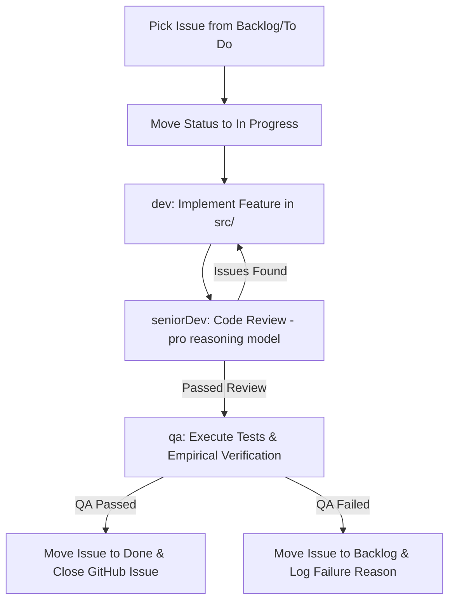

# Feature Subagent Workflow Loop

Follow this strict multi-agent workflow when implementing any feature or addressing a GitHub Issue.

## Workflow Execution Steps

### Step 1: Implementation (`dev`)
- Select target feature/issue.
- Update GitHub project status to `In Progress`.
- Implement code in `src/<feature_name>/` adhering to module `SKILL.md` and type hinting rules.

### Step 2: Code Review (`seniorDev` - `pro` model)
- Invoke `seniorDev` with `Model: "pro"`.
- Inspect git diff against `PLAN.md`, `AGENTS.md`, and type safety rules.
- If Critical/Important issues exist, `dev` fixes them before testing.

### Step 3: QA & Empirical Verification (`qa`)
- Invoke `qa` to execute test commands (`pytest`, `python main.py -i <test_video>`).
- Verify timestamp integrity, CLI flags, and edge cases (missing audio, invalid paths).

### Step 4: Card & Issue Status Update
- **If QA Passes:**
  - Move GitHub project item to **Done**.
  - Close GitHub issue via `gh issue close <issue_number>`.
- **If QA Fails:**
  - Move GitHub project item back to **Backlog**.
  - Comment failure details on GitHub issue via `gh issue comment <issue_number> --body "<failure summary>"`.
